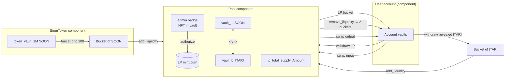

# OotleSwap

A constant-product (Uniswap V2 style) AMM for Tari Ootle, plus a $SOON test token.
**Live on Esmeralda testnet** — this is (to our knowledge) the first DEX deployed on Tari.

## Live deployment (Esmeralda)

| Name | Address |
|---|---|
| `SOON_TEMPLATE` | `template_c57dd1a2529152fd20f9f75a62c15210db6ae101fb12c22882be138c3f625baa` |
| `POOL_TEMPLATE` | `template_317286e75618ff23f9ab6af0174bb08292fb04d9412033623c962824fcfe3cfa` |
| `SOON_COMPONENT` | `component_7c20414944194b905f9f63c73f479c80bf03627483276cf51f0f8a8c08a3b8fd` |
| `SOON_RESOURCE` | `resource_7ca2d0f6b8b17000eb3b00d8d8c0e358c6ad097b9c4ba6b417823bcaead6062f` |
| `POOL_COMPONENT` | `component_3ab560338b91343b1a6ec1ccb21e47b23b3743ee72475603a0b0d1f41c147e40` |
| `LP_RESOURCE` | `resource_3aaa0b1a17c896861fab1c3dc05de0dfc0173ed844338e935114038abfdb8db9` |

Initial pool reserves: 100 SOON + 10 tTARI. Built against `tari_template_lib = 0.26`,
talks to walletd v0.30.x.

## Layout

```
ootleswap/
├── pool/         # Generic AMM pool template (one per token pair)
├── soon_token/   # $SOON test token with public faucet
├── factory/      # Pool factory + permissionless registry (lookup by pair)
├── cli/          # CLI demo: fresh wallet → faucet → swap, end-to-end
├── scripts/      # Wallet manifests for every operation
├── build.sh      # Builds all WASM artifacts
└── DEPLOY.md     # Esmeralda testnet deploy runbook
```

## Try the live pool from your terminal

```bash
cd cli && cargo build --release
./target/release/soonswap
```

This generates a fresh keypair, claims tTARI from the faucet, and executes a 1 tTARI → SOON swap on the live Esmeralda pool. Prints the swap event with input/output amounts.

`pool/` and `soon_token/` are **independent** Cargo packages (not a workspace) —
this is required so that `tari_template_test_tooling` can find each template's WASM
in its own `target/` directory during tests.

## Build

```bash
./build.sh
```

## Test

```bash
cd pool && cargo test --release
cd soon_token && cargo test --release
```

## Deploy

See [DEPLOY.md](./DEPLOY.md) for end-to-end instructions on publishing to the
Esmeralda testnet and creating the first $SOON / tTARI pool.

## Architecture



**Swap math** (constant product with 0.3% fee):

```
amount_out = (amount_in * 997 * reserve_out)
           / (reserve_in * 1000 + amount_in * 997)
```

**Bootstrap LP minted** (Uniswap V2 first-LP-attack mitigation):

```
initial_lp = sqrt(amount_a * amount_b) - MINIMUM_LIQUIDITY
        (where MINIMUM_LIQUIDITY = 1000 micro-units, locked forever)
```

**Proportional add LP minted**:

```
lp_to_mint = min(in_a * total_lp / reserve_a,
                 in_b * total_lp / reserve_b)
```

## Design notes

- **0.3% swap fee** (997/1000), accrues to LPs.
- **Bootstrap LP** = `sqrt(amount_a * amount_b)` minus a `MINIMUM_LIQUIDITY=1000`
  burn (Uniswap V2 first-LP-attack mitigation).
- **Direction-agnostic swap**: a single `swap(input)` method dispatches by
  `input.resource_address()`.
- **Stealth/confidential safety**: every entry point that accepts a `Bucket` calls
  `bucket.assert_contains_no_confidential_funds()` before doing anything. tTARI is
  a stealth resource; pools only operate on its **revealed** sub-balance, so
  silently accepting confidential commitments would desync reserves.
- **LP supply tracked in component state** (no `ResourceManager::total_supply()`
  call needed).
- Internal **u128 sqrt** because `Amount::checked_sqrt` is feature-gated
  (`extra-arith`) and not enabled in the published `tari_template_lib_types`.
